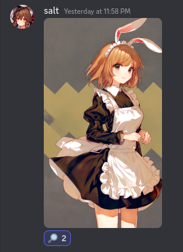
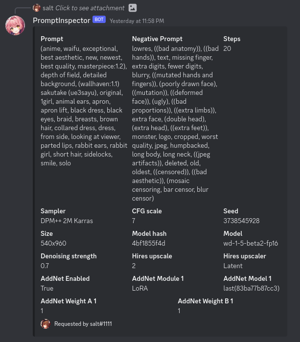

# UPDATE

As of 3/31/2023, discord strips all exif data from images uploaded on discord. In order to have the prompt be usable by Prompt Inspector,
you must install a webui extension that adds prompt data into the alpha channel of the image. The difference is not noticable to the human eye.
https://github.com/ashen-sensored/sd_webui_stealth_pnginfo

# Prompt Inspector 🔎
Inspect prompts 🔎 from images uploaded to discord

## Functionality

This Discord bot reacts to any image with generation metadata from Automatic1111's WebUI.
If generation metadata is detected, a magnifying glass react is added to the image. If the user
clicks the magnifying glass, they are sent a DM with the image generation information.

## Setup

1. Clone the repository
2. Install the dependencies with `pip install -r requirements.txt`
3. Create a Discord bot and invite it to your server
4. Enable the `Message Content Intent` in the Discord developer portal
5. Enable the `Server Members Intent` in the Discord developer portal
6. Create a file named ".env" in the root directory of the project
7. Set `BOT_TOKEN=<your discord bot token>` in the .env file
8. Add the channel IDs you want the bot to work in into the `config.toml` file
9. Run the bot with `python3 PromptInspector.py`

## Examples

